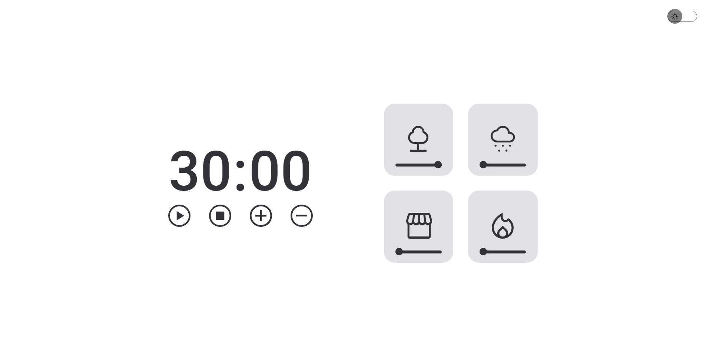
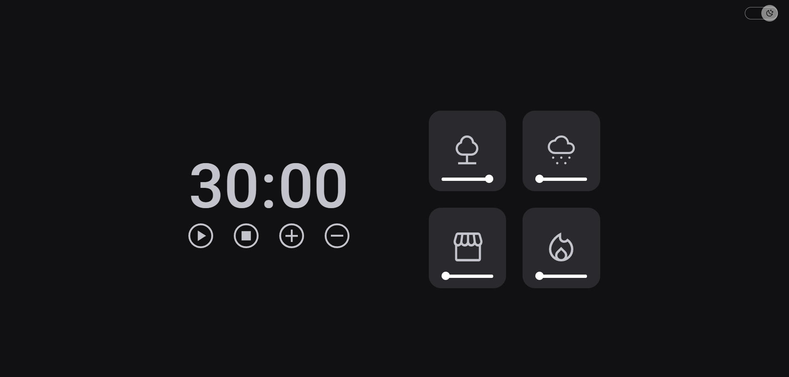
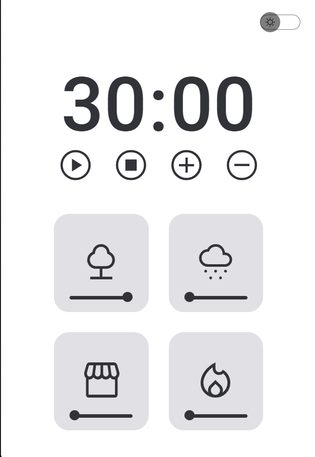
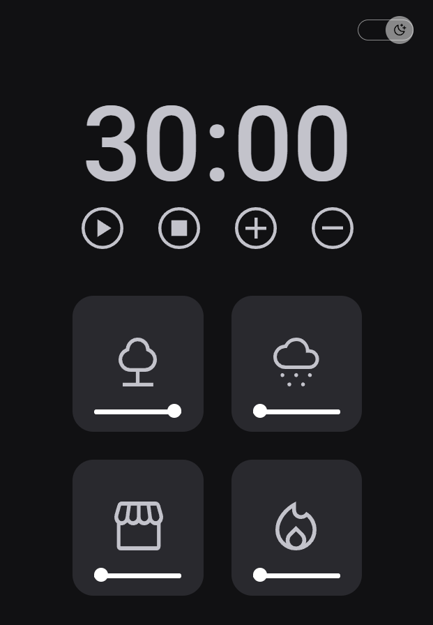

<h1 align="center"> 
  
  Focus Time V2.0
</h1>

  

  

  
  

## 🚀 Technologies

This project was developed with the following technologies:

- HTML e CSS
- Module attribute JavaScript
- Factory e Injeção de dependências
- JavaScript
- Figma

## 💻 Project

Focus time Pomodoro style, with Lo-Fi music.
In this project use concepts like:
* Clean Code.
* factory.
* Dependency injection.
* Mode Dark/Light
* Track Volume

- [Access the finished project, online](https://arks-lacerda.github.io/02-focusTimePlus/)

## 🔖 Layout

Project layout [FROM THIS LINK](https://www.figma.com/file/TF8rbIXkqAz4EDeWmOPH4g/Stage-05---Focus-Timer-2.0-(Copy)).
